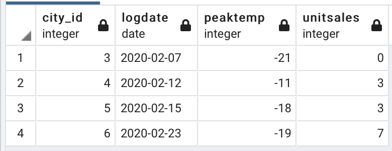

### Реализация партиционирования с использованием Postgres
#### Для реализации данной лабораторной работы требуется:
- Необходимо запустить СУБД с поддержкой партиционирования (например, postgres)
- Создать таблицу с использованием партиционирования
- Написать запросы:
вставки данных
добавления и удаления партиций
создания глобальных и локальных индексов
выборки данных и использованием индексов

 
#### Для сдачи работы требуется предоставить ссылку на git репозиторий в котором находятся:
- Написанные запросы с описанием на естественном языке

#### В PostgreSQL встроена поддержка следующих видов партиционирования:

- Партиционирование по интервалам. Таблица разбивается на интервалы, задаваемые ключевой колонкой или множеством колонок. Интервалы для каждой партиции не пересекаются. 
- Партиционирование по списку. Таблица разбивается при помощи явного перечисления для каждого ключа, в какой партиции содержится значение.

#### Реализация

1. Создадим таблицу, которую в дальнейшем будем разделять на части:
```
CREATE TABLE measurement (
    city_id         int not null,
    logdate         date not null,
    peaktemp        int,
    unitsales       int
) PARTITION BY RANGE (logdate);
```
В нашем примере мы используем разделение по диапазону, а столбец `logdate` будет использоваться как ориентир для разделения.

2. Следующим шагом будет создание самих частей (партиций \ разделов):
```
CREATE TABLE measurement_y2020m01 PARTITION OF measurement
    FOR VALUES FROM ('2020-01-01') TO ('2020-02-01');
CREATE TABLE measurement_y2020m02 PARTITION OF measurement
    FOR VALUES FROM ('2020-02-01') TO ('2020-03-01');
CREATE TABLE measurement_y2020m03 PARTITION OF measurement
    FOR VALUES FROM ('2020-03-01') TO ('2020-04-01');
CREATE TABLE measurement_y2020m04 PARTITION OF measurement
    FOR VALUES FROM ('2020-04-01') TO ('2020-05-01');
CREATE TABLE measurement_y2020m05 PARTITION OF measurement
    FOR VALUES FROM ('2020-05-01') TO ('2020-06-01');
CREATE TABLE measurement_y2020m06 PARTITION OF measurement
    FOR VALUES FROM ('2020-06-01') TO ('2020-07-01');
CREATE TABLE measurement_y2020m07 PARTITION OF measurement
    FOR VALUES FROM ('2020-07-01') TO ('2020-08-01');
CREATE TABLE measurement_y2020m08 PARTITION OF measurement
    FOR VALUES FROM ('2020-08-01') TO ('2020-09-01');
CREATE TABLE measurement_y2020m09 PARTITION OF measurement
    FOR VALUES FROM ('2020-09-01') TO ('2020-10-01');
CREATE TABLE measurement_y2020m10 PARTITION OF measurement
    FOR VALUES FROM ('2020-10-01') TO ('2020-11-01');
CREATE TABLE measurement_y2020m11 PARTITION OF measurement
    FOR VALUES FROM ('2020-11-01') TO ('2020-12-01');
CREATE TABLE measurement_y2020m12 PARTITION OF measurement
    FOR VALUES FROM ('2020-12-01') TO ('2021-01-01');
```
Мы создали 12 партиций, при этом каждая партиция начинается первого числа текущего месяца и заканчивается первым числом следующего месяца.

3. Для каждой партиции создадим индекс по ключевым колонкам
```
CREATE INDEX measurement_y2020m01_logdate ON measurement_y2020m01 (logdate);
CREATE INDEX measurement_y2020m02_logdate ON measurement_y2020m02 (logdate);
CREATE INDEX measurement_y2020m03_logdate ON measurement_y2020m03 (logdate);
CREATE INDEX measurement_y2020m04_logdate ON measurement_y2020m04 (logdate);
CREATE INDEX measurement_y2020m05_logdate ON measurement_y2020m05 (logdate);
CREATE INDEX measurement_y2020m06_logdate ON measurement_y2020m06 (logdate);
CREATE INDEX measurement_y2020m07_logdate ON measurement_y2020m07 (logdate);
CREATE INDEX measurement_y2020m08_logdate ON measurement_y2020m08 (logdate);
CREATE INDEX measurement_y2020m09_logdate ON measurement_y2020m09 (logdate);
CREATE INDEX measurement_y2020m10_logdate ON measurement_y2020m10 (logdate);
CREATE INDEX measurement_y2020m11_logdate ON measurement_y2020m11 (logdate);
CREATE INDEX measurement_y2020m12_logdate ON measurement_y2020m12 (logdate);
```
Партиции могут иметь свои собственные индексы, ограничения и значения по умолчанию, не связанные с другими партициями. Индексы должны создаваться отдельно для каждой партиции. 

4. Добавим немного данных в главную таблицу
```
INSERT INTO measurement VALUES(1,'2020-01-01',-11,5);
INSERT INTO measurement VALUES(1,'2020-01-08',-20,5);
INSERT INTO measurement VALUES(1,'2020-02-07',-21,0);
INSERT INTO measurement VALUES(1,'2020-02-12',-11,3);
INSERT INTO measurement VALUES(1,'2020-02-15',-18,3);
INSERT INTO measurement VALUES(1,'2020-02-23',-19,7);
INSERT INTO measurement VALUES(1,'2020-03-02',-13,2);
INSERT INTO measurement VALUES(1,'2020-04-06',5,0);
INSERT INTO measurement VALUES(1,'2020-05-07',15,0);
INSERT INTO measurement VALUES(1,'2020-06-12',23,0);
INSERT INTO measurement VALUES(1,'2020-07-15',20,0);
INSERT INTO measurement VALUES(1,'2020-08-17',16,0);
INSERT INTO measurement VALUES(1,'2020-09-22',12,0);
INSERT INTO measurement VALUES(1,'2020-10-12',9,0);
INSERT INTO measurement VALUES(1,'2020-11-22',-1,0);
INSERT INTO measurement VALUES(1,'2020-12-01',-5,0);
```
Теперь, если мы захотим получить данные за второй месяц мы можем выполнить следующий запрос `SELECT * FROM public.measurement_y2020m02`.

Мы видим, что в ответ получили данные относящиеся только ко второй партиции.

Допустим, мы храним данные только за последний год. Для того, чтобы избавиться от старой партиции мы можем ввести следующую команду:
```
DROP TABLE measurement_y2020m01;
```
Теперь наша партация за первый месяц будет удалена.

Также можно сделать партицию самостоятельной таблицей при помощи следующей команды:
```
ALTER TABLE measurement DETACH PARTITION measurement_y2020m01;
```


Таким образом партиционирование имеет следующие преимущества:
- Скорость выполнения запросов может возрасти в некоторых ситуациях, особенно если большинство запрашиваемых строк находится в одной партиции или в небольшом их числе.
- Когда происходит чтение или обновление большого числа строк внутри одной партиции, скорость запроса может быть увеличена за счёт последовательного сканирования партиции вместо доступа по индексу или случайного доступа к данным по всей таблице.
- Добавление и удаление одновременно большого массива данных может быть выполнено с помощью добавления или удаления партиций, если это было учтено при проектировании. Применение ALTER TABLE DETACH PARTITION или удаление отдельной партиции при помощи DROP TABLE работают быстрее, чем удаление строк по отдельности.
- Редко используемые данные могут быть перенесены в более дешевые и медленные хранилища.
